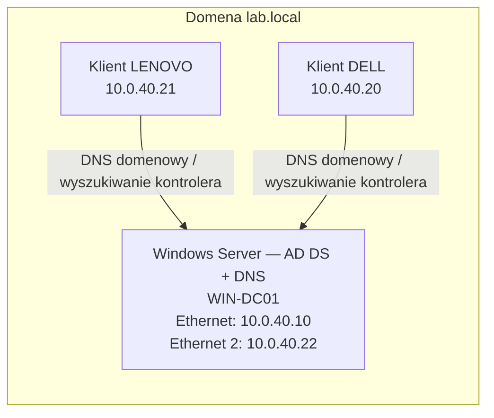

# Active Directory — lab pod stanowisko Helpdesk / IT Support

Laboratoryjne środowisko do ćwiczenia podstaw administracji Active Directory oraz diagnostyki komputerów i kont domenowych. To **własny lab**, nie opis wdrożenia produkcyjnego ani zawodowej obsługi zgłoszeń. Dokumentacja rozróżnia to, co zostało zaobserwowane, od rzeczy wymagających dalszej weryfikacji.

## Schemat środowiska



Obaj klienci pracują na osobnych nodach labu. Dwa adresy kontrolera domeny oznaczają **jeden serwer z dwoma interfejsami**, a nie dwa niezależne kontrolery czy redundantne serwery DNS. Strzałki przedstawiają potwierdzone wyszukiwanie kontrolera domeny; nie są diagramem wszystkich połączeń sieciowych.

## Zidentyfikowane elementy

| Element | Stan zaobserwowany w labie |
| --- | --- |
| Domena | `lab.local`, nazwa NetBIOS `LAB` |
| Kontroler domeny | `WIN-DC01.lab.local`; interfejsy `10.0.40.10` i `10.0.40.22` |
| DNS | Na serwerze widoczne strefy `lab.local` i `_msdcs.lab.local` |
| Klient LENOVO | `10.0.40.21`; `PartOfDomain = True`, domena `lab.local` |
| Klient DELL | `10.0.40.20` według inwentaryzacji labu; test odnalezienia DC i wynik zasad użytkownika opisane poniżej. Osobny odczyt `PartOfDomain` nie został jeszcze udokumentowany. |

### Struktura AD

Odczyt `Get-ADOrganizationalUnit` pokazał: `Company`, `Administracja`, `Produkcja`, `Magazyn`, `Logistyka` oraz systemową `Domain Controllers`. W pokazanym wyniku jednostki `Administracja`, `Produkcja`, `Magazyn` i `Logistyka` są **bezpośrednio pod domeną**, a nie wewnątrz `Company`. Nie zakładam, że samo istnienie OU dowodzi poprawności uprawnień lub stosowania GPO.

## Diagnostyka wykonana na klientach

| Sprawdzenie | LENOVO (`.21`) | DELL (`.20`) |
| --- | --- | --- |
| Wyszukiwanie DC (`nltest /dsgetdc:lab.local`) | Sukces; znaleziono DC pod `10.0.40.10` | Sukces; znaleziono DC pod `10.0.40.10` |
| DNS skonfigurowany na interfejsie klienta | `10.0.40.10`, `8.8.8.8` | `10.0.40.10`, `8.8.8.8` |
| Wynikowe zasady użytkownika (`gpresult /r`) | Dla konta w OU `Logistyka`: `Regional`, `control panel` | Dla konta w OU `Magazyn`: `Regional` |

`gpresult /r` potwierdza, które GPO zostały zastosowane **w pokazanym kontekście użytkownika**. Sama nazwa GPO nie dowodzi, jakie dokładnie ustawienie zmienia ani czy jego zamierzony efekt został przetestowany. Zakres, powiązania i konfigurację tych polityk trzeba jeszcze opisać na podstawie Group Policy Management oraz testu zachowania na kliencie.

## Użyte polecenia diagnostyczne

Poniższe polecenia służą do odczytu konfiguracji; nie tworzą ani nie modyfikują obiektów AD.

Na serwerze, w PowerShell z modułem ActiveDirectory:

```powershell
Get-ADDomain | Select-Object DNSRoot, NetBIOSName
Get-ADDomainController -Filter '*' | Select-Object HostName, Site, IPv4Address
Get-ADOrganizationalUnit -Filter '*' | Select-Object Name, DistinguishedName
Get-NetIPAddress -AddressFamily IPv4 | Select-Object InterfaceAlias, IPAddress
```

Na klientach Windows:

```powershell
Get-CimInstance Win32_ComputerSystem | Select-Object Name, Domain, PartOfDomain
Get-DnsClientServerAddress -AddressFamily IPv4 | Select-Object InterfaceAlias, ServerAddresses
nltest /dsgetdc:lab.local
gpresult /r
```
